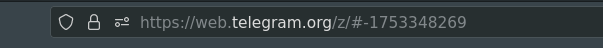

# Instalação

Para fazer a instalação do app você precisará baixar o python [AQUI](https://www.python.org/downloads/)

E então fazer a instalação do arquivo requirements.txt
> python pip install -r requirements.txt

# Criar o arquivo de configuração ( .env )
Tem um .env.exemplo basta copiá-lo e colocar as informações.

## SIGNAL
SIGNAL="FRASE DA PRIMEIRA LINHA DA MENSAGEM"

## BOT_TOKEN
 Crie um bot com o [@BotFather](https://web.telegram.org/k/#@BotFather) e cole o token dele

## GROUP_ID
Você pode pegá-lo no link do grupo com a versão z do telegram web

**Copie APENAS OS NÚMEROS**

## API_ID e API_HASH
Para conseguí-los você deverá criar uma conta de desenvolvedor em [Telegram](https://my.telegram.org/auth?to=apps)

Logar com seu número telegram que tem acesso ao grupo.

E então criar uma aplicação, basta preencher o titulo e um breve descricao.

E então você terá a api_id e api_hash

# Configurando o Metatrader 4

Vá até 