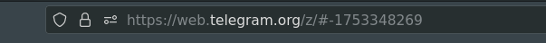
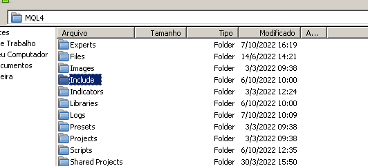
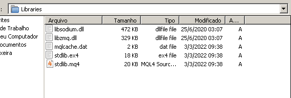
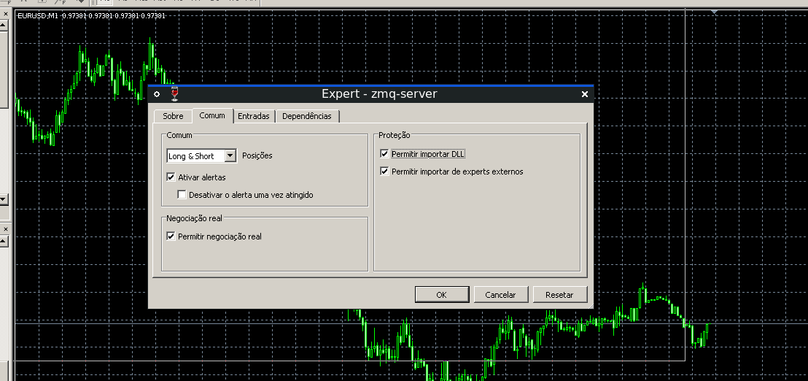
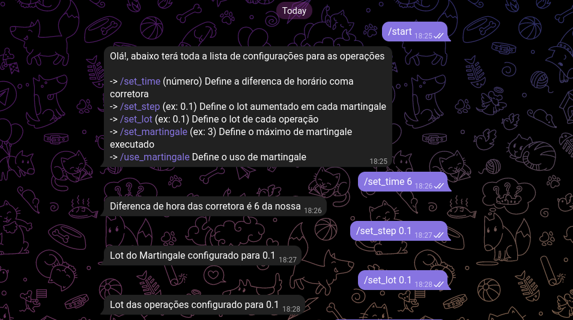

# Instalação

Para fazer a instalação do app você precisará baixar o python [AQUI](https://www.python.org/downloads/)

E então fazer a instalação do arquivo requirements.txt
> python -m pip install -r requirements.txt

# Criar o arquivo de configuração ( .env )
Tem um .env.exemplo basta copiá-lo e colocar as informações.

## SIGNAL
SIGNAL="FRASE DA PRIMEIRA LINHA DA MENSAGEM"

## BOT_TOKEN
 Crie um bot com o [@BotFather](https://web.telegram.org/k/#@BotFather) e cole o token dele

## GROUP_ID
Você pode pegá-lo no link do grupo com a versão z do telegram web

**Copie APENAS OS NÚMEROS**

## API_ID e API_HASH
Para conseguí-los você deverá criar uma conta de desenvolvedor em [Telegram](https://my.telegram.org/auth?to=apps)

Logar com seu número telegram que tem acesso ao grupo.

E então criar uma aplicação, basta preencher o titulo e um breve descricao.

E então você terá a api_id e api_hash

# Configurando o Metatrader 4

Vá até **Arquivo> Abrir Pasta de Dados** e copie o que esta na pasta **Include**

para dentro da pasta Include do MQL4.

Após isto, copiar as *.dll* que esta dentro de **Library/MT4** para a pasta Libraries no mt4

E então basta apenas copiar o arquivo **zmq-server.ex4** para a pasta **Experts** no mt4

### Obs: Não esqueca de permitir dll no Metatrader 4 ao colocar no gráfico!

# Rodando o Bot

Após o arquivo .env estar configurado e o EA já estar rodando no Metatrader 4

Você apenas ir no terminal e com o caminho onde estão os arquivos estraidos executar

> python app.py

Após isto, irá ter um terminal como este!

Então você coloca o seu número que esta o grupo e o bot e confirma

**OBS. O Número precisa estar com o código do País! ex. +551290000-0000**

Irá ser enviado um código para seu telegram e basta apenas você o digitar no terminal!

Então esta totalmente configurado e você já pode usar o /start no seu bot criado!

## Agora só sentar e esperar :D

# Funções do Bot Versão 1.0

- [x] Usar Martingale.
- [x] Configurar Máximo Martingale.
- [x] Configurar Step do Lot Martingale.
- [x] Configurar Lot dos Trades.
- [x] Configurar Diferença de Horário entre corretoras.
- [x] Criar entradas no Metatrader 4 sempre que chegar uma mensagem do grupo.